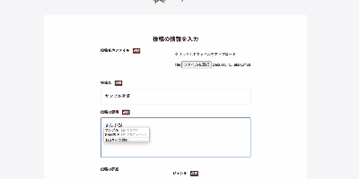
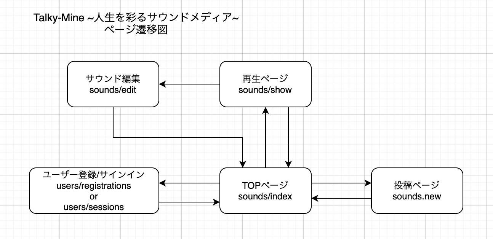
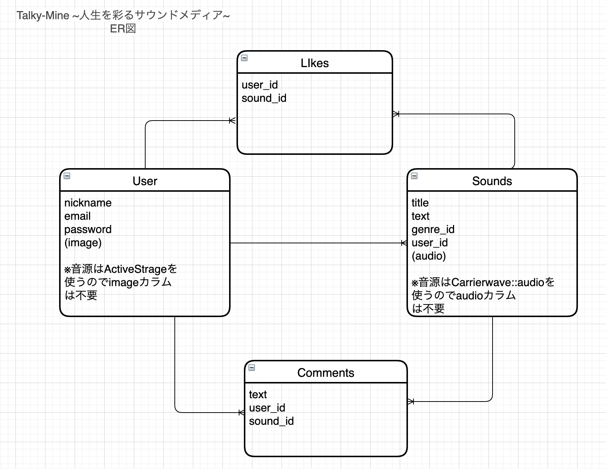

README

# Talky-Mine

## アプリケーション概要
このアプリケーションは音源を投稿し、公開する事ができるサウンドメディアです。公開する事ができます。ユーザーはパーソナリティにもリスナーにもなる事ができます。
サウンドは動画メディアやゲームと違い何かをしながら楽しむ事が可能です。
また、投稿者として他者に語りかける事により自身の発信する内容に対して深い理解を得る事ができます。

## アプリケーションURL
https://talky-mine-29213.herokuapp.com/

## テスト用アカウント

| 適用         | id(Email)         | password   |
| ----------- | ----------------- | ---------- |
| Basic認証    | admin             | 2222       |
| 投稿ユーザー   | toukou@gmail.com  | sample6    |
| 試聴ユーザー   | shichou@gmail.com | sample6    |

## 利用方法

1. ユーザーログインをした後、ページ右上の「投稿する」をクリック
2. MP3ファイル等の音源ファイルをアップロード
3. トップページから投稿した内容のサムネイルをクリック
4. 詳細ページに遷移するので、そこでサウンドプレイヤーを再生

## 目指した課題解決
このアプリケーションは下記のような人達の課題を解決するために開発しました。

* **ペルソナ** 
ランニングや筋トレ、または家事などの何か作業をしながら学習したい20~40代の男女

* **課題** 
多くの社会人は在宅勤務など就業環境の変化により、家で使える時間が増えた。その中で自己研鑽になるような活動を求める人には、動画や読書など時間を専有するものでなく、家事や筋トレ等をしながら学べるような、時間を併用できるメディアが必要とされていた。

## 洗い出した要件

### 1, 投稿機能

**【優先順位:高】** 

**目的：** 
オーディオファイルを投稿する 
 
**詳細：** 
ログインしたユーザーは、新規投稿画面から自身の持つオーディオファイルを投稿し、公開する 
 
**ストーリー(ユースケース)：** 
・あるユーザーは日々の生活の中から画期的な学びを得た。 
・その学びを誰かに共有する事と共に、自身の理解を深めるために誰かに話したかった。 
・サウンド投稿メディアに投稿する事で自身の考えを発信し、共有する事ができた。 
 
**見積もり(所要時間):**  
3時間 

### 2, 再生機能
**【優先順位:高】** 

**目的：** 
投稿されたオーディオファイルを再生する 
 
**詳細：** 
トップページの投稿一覧から投稿音源のサムネールをクリックする事で再生ページに遷移する。 
再生ページのオーディオプレイヤーを再生する事で投稿されたオーディオファイルを試聴できる。 
 
**ストーリー(ユースケース)：** 
・あるユーザーは自宅で過ごす時間が増えた事をきっかけに、以前より家事や運動をする事が増えた。
 
・作業をする時間の中で、何か学びに活かせる事はできないかと考えた。 
・サウンドメディアを再生しながら作業する事で、時間を効率的に使いながら学ぶ事ができた。 
 
**見積もり(所要時間):**  
5時間 

### 3, コメント機能
**【優先順位:中】** 

**目的：** 
オーディオファイル再生ページにコメントする 
 
**詳細：** 
投稿内容に応じて、試聴したユーザーはコメントを記載する事ができる。 
 
**ストーリー(ユースケース)：** 
・あるユーザーは試聴した投稿内容について、印象に残ったと同時に疑問を感じので、その旨を投稿者や他のリスナーに対して意見を聞いてみたくなった。 
・コメントを残す事で、その疑問を投稿者や他のリスナーと共有でき、またコメントへの返信があった事でいろいろな意見を聞くことができた。 
 
**見積もり(所要時間):**  
4時間 

### 4, いいね機能
**【優先順位:低】** 

**目的：** 
投稿音源に対して好印象を表現する 
 
**詳細：** 
投稿内容を試聴したユーザーは"いいね"ボタンを押すことで高評価を表現する事ができる。 
 
**ストーリー(ユースケース)：** 
・あるユーザーは試聴した投稿内容がとても魅力的に感じたので良い評価を投稿者に伝えたかった。 
・いいねボタンを押すことで手軽に高評価の反応を示す事ができた。 
 
**見積もり(所要時間):**  
4時間 

## 実装した機能

1. ユーザーがパーソナリティーとなり、MP3などのオーディオファイルをアップロードし、投稿一覧に公開される機能。
2. ユーザーはアップロードされたオーディオファイルを投稿一覧から選択し、試聴できる機能。
3. 再生ページにコメントを記述でき、リスナー側のユーザーとパーソナリティー側のユーザーがコミュニケーションを取れる機能。
4. ユーザーは投稿された音源に対して"いいね"ボタンが押せ、その"いいね"のカウント数が再生ページと投稿一覧ページに表示される機能。

## 挙動確認

1. オーディオファイルの投稿 

2. 再生ページで再生

## データベース設計

## ローカルでの動作確認方法

1. % git clone https://github.com/BugGreedy/talky-mine.git 
2. % cd talky-mine
3. % bundle install
4. % rails db:create
5. % rails db:migrate
6. % rails s
7. http://localhost:3000/ へアクセス

## version info 
* Ruby _6.0.0_ 